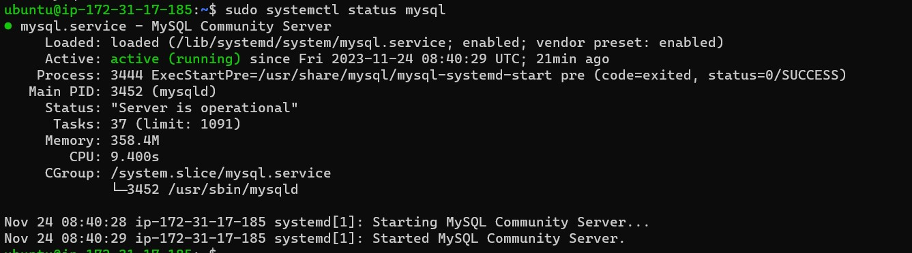

# Project1 - Web stack implementation
-*Installing windows terminal*
-*Creating EC2 instance along with the security group in the AWS cloud*
-*Generate SSH keys in AWS for the EC2 instance , ssh into EC2 from the windows terminal*

*Install Apache2*
`sudo apt update`
`sudo apt install apache2`

*Verify running of apache2*
`curl http://localhost:80`
`curl -s http://169.254.169.254/latest/meta-data/public-ipv4`

*My sql installation and verify*
`sudo apt install mysql-server`
`sudo mysql`

*Install php*
`sudo apt install php libapache2-mod-php php-mysql`
`php -v`

*VIRTUAL HOST FOR YOUR WEBSITE*

`sudo mkdir /var/www/projectlamp`
`sudo chown -R $USER:$USER /var/www/projectlamp`
`sudo vi /etc/apache2/sites-available/projectlamp.conf`
`sudo a2ensite projectlamp`

`sudo echo 'Hello LAMP from hostname' $(curl -s http://169.254.169.254/latest/meta-data/public-hostname) 'with public IP' $(curl -s http://169.254.169.254/latest/meta-data/public-ipv4) > /var/www/projectlamp/index.html`

*enable php*

`vim /var/www/projectlamp/index.php`

